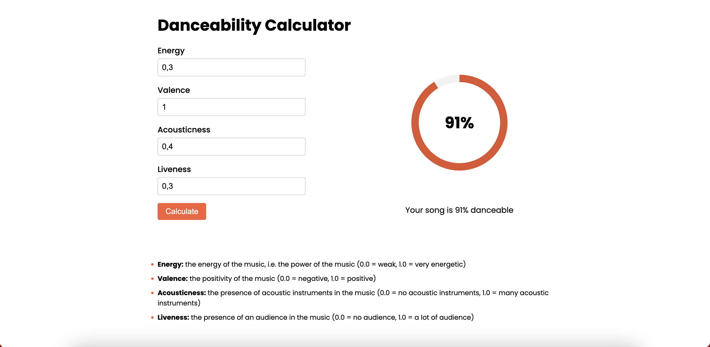

# ECVPythonAI
- [Introduction](#introduction)
- [Analysis](#analysis)
- [Installation](#installation)
    - [Get model](#get-model)
    - [Run api](#run-api)
    - [Run front](#run-front)
- [Screenshots](#screenshots)

## Introduction
#### Description
This project is a simple example of a machine learning project. 
The goal is to predict the danceability of a song.

The data is taken from [Kaggle](https://www.kaggle.com/datasets/maharshipandya/-spotify-tracks-dataset?select=dataset.csv).

After a first analysis, we can see that the data is not very clean.
We have to do some cleaning before we can use it.

And after a second analysis, we can see 4 points that are important for the prediction:
- acousticness
- energy
- liveness
- valence

We use the XGBoost Regressor algorithm to train the model.
The model is saved in `resources/xgb.json`.

After that, we create a simple API with FastAPI.
The API is available at `http://localhost:8000/` and as just one endpoint: `/` in POST method.

Finally, we create a simple front with Django available at `http://localhost:8080/` and as also just one route: `/`.

After completing the form, the front send a request to the API and display the result.

#### Main folders
- [resources](resources) : Folder with model and data
- [notebooks](notebooks) : Folder with notebooks
- [api](api) : Folder with API
- [front](front) : Folder with front
- [docs](docs) : Folder with documentation

#### Main files
- [Notebook-DataAnalyse](notebooks/Notebook-DataAnalyse.ipynb) : Data analyse and cleaning
- [Notebook-XGBoost](notebooks/Notebook-XGBoost.ipynb) : Train model and save it
- [api/api.py](api/api.py) : API with FastAPI
- [front/form/views.py](front/form/views.py) : Front with Django

## Analysis
For learn the analysis, please read the [Notebook-DataAnalyse](notebooks/Notebook-DataAnalyse.ipynb).

## Installation
### Get model
Run [Notebook-XGBoost](notebooks/Notebook-XGBoost.ipynb). then `resources/xgb.json` will be created.

### Run api
```bash
    cd api

    uvicorn api:app --reload
```

### Run front
```bash
    cd front

    python manage.py runserver 8080
```

## Screenshots

